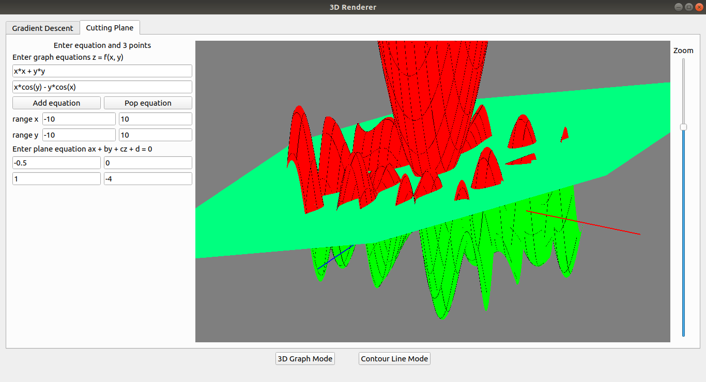

# 3D Graphic

This is a 3D function visualizer tool for educational purpose (computer graphic course)

## Gradient Descent
3D graph mode allow you to visualize mathematical function and draw a gradient descent line on it.


Countour line mode allow you to see graph and gradient descent line in 2d contour mode


## Cutting plane
Allow you visualize multiple mathematical function at the same time and draw a cutting plane through all graphs.


## Getting Started

These instructions will help you to run and build this project

### Prerequisites

You need to install Qt and OpenGL

### Running

```
qmake       # generate Makefile
make        # build project
./3d-graphic    # run program and enjoy!
```

## Built With

* [Qt](https://www.qt.io/) - Cross-platform software development for embedded & desktop
* [OpenGL](https://www.opengl.org/) - The Industry Standard for High Performance Graphics

## Authors

* **ngoctint1lvc@gmail.com** - [ngoctin](https://github.com/ngoctint1lvc)